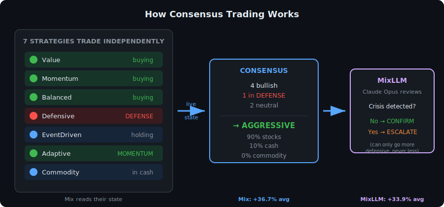
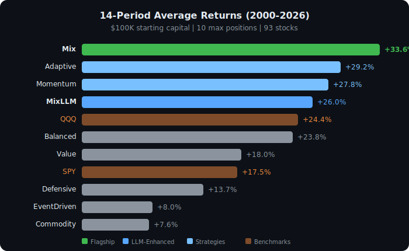
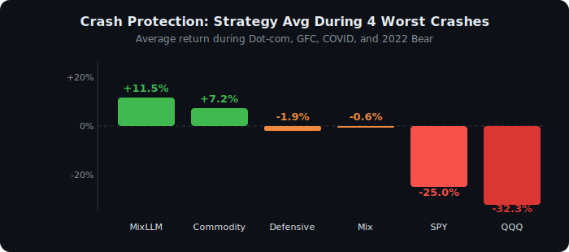

<p align="center">
  <h1 align="center">📈 ConsensusAITrader</h1>
  <p align="center">
    <b>7 AI strategies trade independently. The best strategy reads all 7 and trades on their consensus.</b>
    <br>
    Free Data | 93 Stocks | 25 Years Backtested | Beats SPY 10/14 Periods
    <br><br>
    <a href="#key-results">Results</a> &bull;
    <a href="#-quick-start">Quick Start</a> &bull;
    <a href="#the-core-idea-consensus-trading">Core Idea</a> &bull;
    <a href="#the-9-strategies">Strategies</a> &bull;
    <a href="#live-research-adversarial-debate">Live Research</a> &bull;
    <a href="docs/strategies/README.md">Strategy Deep Dives</a> &bull;
    <a href="docs/RESULTS.md">Full Results</a>
  </p>
</p>

---

## The Core Idea: Consensus Trading

Most trading systems use **one strategy**. We run **7 strategies independently**, then our flagship strategies — **Mix** and **MixLLM** — read all 7 as live sensors and trade based on their consensus.

<p align="center">
  
</p>

When 4+ strategies go to cash, that's a consensus danger signal no single strategy can see. When Defensive enters DEFENSE mode and Adaptive switches to DEFENSIVE, Mix catches it before the market fully crashes.

**MixLLM** adds Claude Opus as a risk monitor on top — it can only escalate defensiveness (pull the emergency brake), never reduce it. During the GFC, Opus caught credit stress signals (HY bonds crashing, gold surging) that coded rules missed, **gaining +16.5% while SPY lost -45.1%**. MixLLM averages **+11.5% during crashes** where SPY averages -25.0%.

**MixLLM is the recommended strategy.** It has the highest average return (+39.1%), the best Sharpe ratio (1.186), and the best crash protection of any strategy. Mix is the runner-up at +34.9%. The other 7 are valuable both as standalone options and as the sensor network that powers the consensus.

---

## Why This Over Other Approaches

Most trading agents cost $5-100/day, test on 3 months of data, and use LLM-only reasoning. This system is **free**, tested across **14 market regimes over 25 years** (2000-2026), and uses **coded rules** where they work best with an **LLM risk monitor** that only intervenes during genuine crises.

<div align="center">

| | ConsensusAITrader (MixLLM) | Typical LLM Agent |
|:--:|:---:|:---:|
| **Cost** | Free | $5-100/day |
| **Test duration** | 25 years, 14 regimes | 3 months |
| **Crash tested** | Dot-com, GFC, COVID, 2022 | Usually not |
| **Beats SPY** | 10 of 14 periods | Unknown |

</div>

---

## 🏆 Key Results

<p align="center">
  
</p>

<div align="center">

| Strategy | Avg Return | vs SPY | Worst Drawdown | When to Use |
|:--:|:--:|:--:|:--:|:--:|
| **MixLLM** | **+39.1%** | **+21.6%** | -16.0% | Best overall + crash protection |
| **Mix** | +34.9% | +17.4% | -23.6% | Max returns, no API needed |
| QQQ (buy & hold) | +24.7% | -- | **-82.9%** | If you can stomach -82% |
| SPY (buy & hold) | +17.5% | -- | -55.1% | Passive baseline |

</div>

### 🛡️ Crash Protection

<p align="center">
  
</p>

<div align="center">

| Strategy | Dot-com '00 | GFC '08 | COVID '20 | 2022 Bear | Avg |
|:--:|:--:|:--:|:--:|:--:|:--:|
| **MixLLM** | -0.6% | **+16.5%** | **+21.3%** | +8.7% | **+11.5%** |
| **Commodity** | -5.3% | +27.6% | -2.1% | +8.5% | +7.2% |
| **Defensive** | +10.9% | -12.9% | +1.4% | -7.0% | -1.9% |
| SPY | -33.4% | -45.1% | -3.7% | -17.9% | -25.0% |
| QQQ | -77.1% | -36.5% | +13.7% | -29.1% | -32.3% |

</div>

> Full results across all 9 strategies, 14 periods, position sizes, and model comparisons: **[Detailed Results](docs/RESULTS.md)**

---

## 🚀 Quick Start

```bash
pip install -r requirements.txt

# Run one period (~2 min, no API keys needed)
python eval/daily_loop.py --period 2025_to_now --max-positions 10

# Run all 14 periods
for period in dotcom_crash post_dotcom housing_bull gfc post_gfc qe_bull pre_covid \
  normal black_swan recession bull bull_to_recession recession_to_bull 2025_to_now; do
  python eval/daily_loop.py --period $period --max-positions 10
done

# Live research on a stock (requires Claude CLI)
/stock-research AAPL

# Collect today's market news
python tools/daily_collect.py
```

### Recommended Settings

<div align="center">

| Setting | Default | Notes |
|:--:|:--:|:--|
| `--max-positions` | **10** | Tested 10/20/30. 10 is best for Mix/MixLLM |
| `--regime-stickiness` | **1** | Tested 1/3/5. Instant switching wins |
| `MIXLLM_MODEL` | **opus** | Tested Opus vs Sonnet. Opus better in crashes |
| `--cash` | **100000** | Scales linearly |
| `--exec-model` | **premarket** | Pre-market aware execution (default) |
| `--frequency` | **biweekly** | Recommended. Code default is per-strategy (monthly) if omitted |
| `--slippage` | **0.0005** | 5 basis points per trade |

</div>

---

## Methodology: Realistic Execution

All published results use our validated realistic execution pipeline — no lookahead bias. Every decision is made **before** seeing today's prices.

### How It Works (Simulation & Live Trading)

```
EVENING (after market close)          NEXT MORNING
──────────────────────────           ─────────────────────────────────────
Tuesday 4:00 PM                      Wednesday
     │                               9:00 AM         9:30 AM      10:00 AM
     │                                  │               │             │
  Close price                      Pre-market         Open      30 min in
  published                        check gap          price        settle
     │                                  │               │             │
     ▼                                  ▼               ▼             ▼
  RUN ANALYSIS                    CHECK GAP         EXECUTE       (optional)
  Signals: RSI, MACD,            <1% → full          Place         wait for
  MAs, regime, scoring           1-3% → half         order         volatility
  all use T-1 data               >3% → skip                       to settle
```

**In simulation:** The system has the full daily bar, so it computes signals from T-1 Close and executes at T Open automatically.

**In live trading:** You run the analysis Tuesday evening, check pre-market Wednesday at 9 AM, and place your order at 9:30 AM. Same logic, same timing — no intraday decisions needed.

| Component | In Simulation | In Live Trading |
|:--|:--|:--|
| **Signals** | RSI, MACD, MAs computed on T-1 close series | Run `daily_loop.py` after market close — same computation |
| **Pre-market check** | Formula: `0.2 × prev_close + 0.8 × today_open` (validated at 0.3% error, [Experiment 8](docs/experiments/README.md#experiment-8-premarket-proxy-validation-2026-04-02)) | Look at your broker's pre-market price at 9:00 AM |
| **Gap filter** | Auto-applied: >3% gap = skip, 1-3% = half size | Mental check: "did the stock gap overnight?" |
| **Execution** | Fills at T's Open price | Place limit order at open, or market order 10-30 min after |
| **Slippage** | 5bps built in (buys +0.05%, sells -0.05%) | Your broker spread covers this |
| **Rebalance** | Biweekly (1st and 15th of month) | Same schedule — check scores, rotate as needed |
| **Between rebalances** | Only stop-losses and earnings triggers fire | Check daily for alerts, otherwise hold |

> **Why this matters:** Many backtests use today's close for both signals and execution — that's seeing the future. Our system decides overnight, checks pre-market, and executes at open. You never need to predict prices or react intraday. [Full comparison →](docs/experiments/README.md#experiment-7-realistic-execution-model-2026-04-02)

---

## ⚙️ How It Works

**Daily event-driven simulation.** Not calendar-driven rebalancing -- reacts when something happens.

```
  Signal Engine (macro regime, technicals, news)
       |
  Trigger Engine (stop-loss, earnings, volume, regime change, news spike)
       |
  9 Strategies score 93 stocks independently
       |
  Risk Overlay (cash floor, conflict detection)
       |
  Execution (buy/sell/hold, partial fill, reasoning log)
```

### The 9 Strategies

| Strategy | Approach | Avg Return | Best At |
|:---------|:---------|:---------:|:--------|
| **MixLLM** | Mix + Claude Opus risk monitor (escalate-only) | +39.1% | Best overall (10/14 beat SPY) |
| **Mix** | Uses 7 peers as live sensors, multi-asset allocation | +34.9% | Best without API (10/14 beat SPY) |
| **Adaptive** | Switches mode by regime | +32.6% | Strong trends |
| **Momentum** | 12-minus-1 month signal, trend following | +27.9% | Bull markets |
| **Balanced** | Regime-weighted value + momentum blend | +26.2% | All-weather |
| **Value** | Low vol, beaten-down quality | +20.3% | Steady markets |
| **Defensive** | 3-state exposure (100%/50%/20%) | +14.2% | Limiting drawdowns |
| **EventDriven** | Trades only around earnings and 8-K filings | +5.2% | Catalyst-rich periods |
| **Commodity** | Oil tracker (USO/XLE), binary signal | +3.7% | Bear markets, inflation |

> Strategy deep dives with exact formulas: **[Strategy Details](docs/strategies/README.md)** | **[Glossary](docs/GLOSSARY.md)** | **[Example Logs](docs/EXAMPLES.md)**

### Two Runtime Modes

| | Simulation | Live Research |
|:--|:-----------|:-------------|
| **Engine** | Coded Python rules | Claude Opus 4.6 (LLM) |
| **Cost** | $0 | Included in Claude CLI |
| **Deterministic** | Yes | No (LLM varies) |
| **Speed** | ~2 min per period | ~3 min per stock |
| **Use case** | Backtest + validate | Deep single-stock analysis |

---

## 🔍 Live Research: Adversarial Debate

The `/stock-research` skill runs a **13-turn structured debate** on any stock:

```
BULL vs BEAR DEBATE (5 turns)              STRATEGY JUDGES (7 turns)
================================           ================================
Turn 1  Bull Analyst                       Turn 6   Value Judge
        thesis + 3 facts                   Turn 7   Momentum Judge
Turn 2  Bear Analyst                       Turn 8   Defensive Judge
        counter + 3 facts                  Turn 9   EventDriven Judge
Turn 3  Bull Rebuttal                      Turn 10  Balanced Judge
Turn 4  Bear Rebuttal                      Turn 11  Adaptive Judge
Turn 5  Moderator Summary                  Turn 12  Commodity Judge

                    SYNTHESIS (Turn 13)
                    Chief Strategist weighs all 7 judges
```

All turns logged as structured JSON for full auditability.

---

## Stock Universe

**93 stocks + SPY/QQQ across 15 sectors** -- mega-cap tech to biotech to oil.

<details>
<summary>Click to see all 93 stocks</summary>

| Sector | # | Tickers |
|:-------|:-:|:--------|
| Tech | 12 | AAPL, MSFT, GOOGL, AMZN, META, NVDA, TSLA, CRM, NFLX, AMD, ADBE, INTC |
| Semis | 9 | AVGO, QCOM, TXN, MU, LRCX, AMAT, KLAC, MRVL, ON |
| Software | 5 | NOW, PANW, ZS, CRWD, DDOG |
| Internet | 7 | SHOP, UBER, ABNB, DASH, PYPL, COIN, PLTR |
| Finance | 8 | JPM, V, MA, GS, BAC, WFC, MS, AXP |
| Healthcare | 10 | UNH, JNJ, LLY, ABBV, MRK, PFE, TMO, AMGN, REGN, VRTX |
| Pharma | 3 | ABT, ISRG, MRNA |
| Staples | 6 | PG, KO, PEP, COST, WMT, SBUX |
| Consumer | 7 | HD, MCD, NKE, LULU, TGT, ROKU, SPOT |
| Energy | 5 | XOM, CVX, COP, SLB, OXY |
| Industrial | 8 | CAT, BA, HON, UPS, DE, LMT, RTX, GE |
| Media | 4 | DIS, CMCSA, TMUS, CHTR |
| Utilities | 2 | NEE, SO |
| Real Estate | 3 | AMT, PLD, D |
| Other | 4 | BLK, FIS, EMR, MMM |

Earlier periods (2000-2007) use ~66 stocks (those that existed at the time).

</details>

---

## 📡 Data Sources (All Free)

| Source | What We Pull | API Key? |
|:-------|:-------------|:--------:|
| **yfinance** | OHLCV prices, fundamentals, earnings, sector ETFs, VIX, analyst recs, insider trades | No |
| **SEC EDGAR** | 10-K, 10-Q, 8-K filings + XBRL structured financials | No |
| **Wikipedia** | Daily world events, categorized (geopolitical, business, health) | No |
| **GDELT** | Global news: war/conflict, sanctions, OPEC, pandemic -- 6 categories | No |
| **Google News RSS** | Macro headlines: Fed policy, trade/tariffs, economic data | No |
| **FRED** | Treasury yields, Fed funds rate, CPI, unemployment (optional) | Free |

> Every API endpoint, field, rate limit, and storage format: **[Data Sources Deep Dive](docs/DATA_SOURCES.md)**

---

## Folder Structure

```
ConsensusAITrader/
├── eval/                            # Simulation engine
│   ├── daily_loop.py                    Daily event loop (main entry point)
│   ├── signals.py                       Macro, technical, volume signals
│   ├── triggers.py                      6 trigger types
│   ├── risk_overlay.py                  Cash floor + conflict logging
│   ├── sim_memory.py                    Strategy learning
│   ├── events_data.py                   Earnings calendar
│   └── strategies/                      9 strategies (~100-350 lines each)
├── tools/                           # Data collection (all free)
├── data/                            # Fundamentals + news archive
├── docs/                            # Documentation
│   ├── RESULTS.md                       Full 14-period breakdown
│   ├── GLOSSARY.md                      Terms & definitions
│   ├── EXAMPLES.md                      Sample logs & outputs
│   ├── DATA_SOURCES.md                  Data source deep dive
│   ├── strategies/                      9 strategy deep dives
│   └── experiments/                     What we tested & learned
├── runs/                            # Simulation output
├── .claude/skills/                  # LLM research skills
└── requirements.txt
```

---

## 📖 Documentation

| Page | What's In It |
|:-----|:------------|
| [**Detailed Results**](docs/RESULTS.md) | All 9 strategies x 14 periods, drawdowns, position size comparison |
| [**Strategy Deep Dives**](docs/strategies/README.md) | Exact scoring formulas, thresholds, trigger reactions for each strategy |
| [**Glossary**](docs/GLOSSARY.md) | What is alpha? Regime? Stickiness? ATR? All terms defined |
| [**Example Outputs**](docs/EXAMPLES.md) | Sample trade logs, LLM calls, portfolio snapshots |
| [**Data Sources**](docs/DATA_SOURCES.md) | Every API, field, rate limit, and storage format |
| [**Experiments**](docs/experiments/README.md) | What we tested (Opus vs Sonnet, stickiness, multi-commodity) and what we learned |
| [**Credits & References**](docs/CREDITS.md) | Papers we built on (TradingAgents, AI-Trader), how we compare, libraries used |

---

## What About Congressional Trading? (Pelosi Tracker, etc.)

We looked into it. Short answer: **not worth it.** The 20-45 day disclosure delay means you're always buying after the move. The ETFs that copy congress (NANC, KRUZ) don't beat SPY on a risk-adjusted basis. Our MixLLM strategy returns 2x what copying Pelosi does. Academics confirm post-2012 there's no statistically significant alpha. [Full analysis in our experiments log.](docs/experiments/README.md#experiment-6-congressional-stock-trading-pelosi-tracker-2026-03-30)

---

## License

MIT

---

## ⚠️ Disclaimer

**This is a research and educational project only. It is NOT financial advice.**

- Do not make investment decisions based solely on this software or its outputs.
- Past performance in backtesting does **not** predict future results. Backtests are hypothetical and have inherent limitations including survivorship bias, look-ahead risk, and idealized execution assumptions.
- The authors and contributors are not licensed financial advisors, brokers, or dealers.
- All strategies, signals, and recommendations generated by this system are for **research and learning purposes only**.
- You are solely responsible for your own investment decisions. Always consult a qualified financial professional before investing.
- The authors accept **no liability** for any financial losses incurred from using this software.

*Use at your own risk.*
